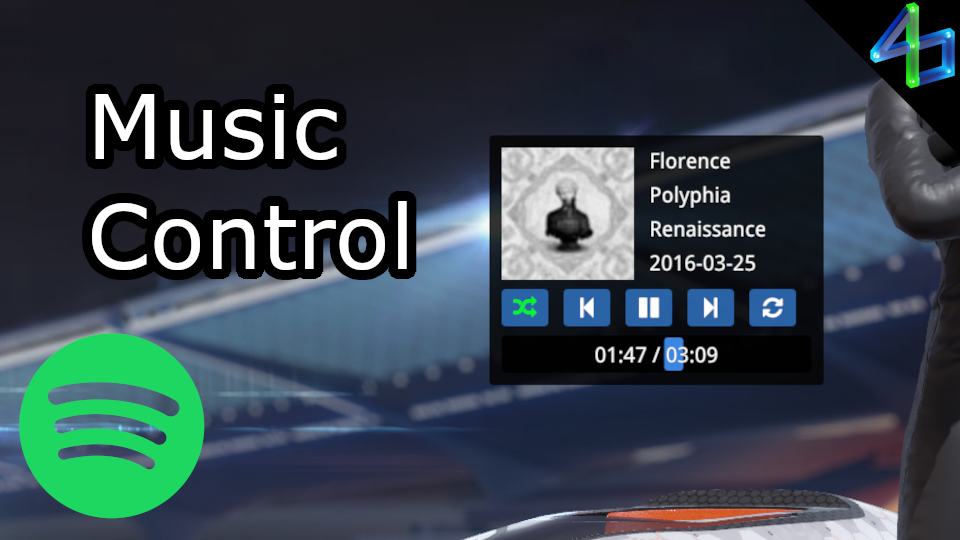

# Music Control

Adds a simple music player. Currently only Spotify is supported, and sadly due to API restrictions you will need a Premium account for most actions. There is also some setup required with your Spotify account, but instructions are included and are pretty easy to follow.

This does NOT play music within the game. You must be listening to Spotify elsewhere (i.e. the official desktop app) and this plugin will control playback from there.

There are some notable features missing (but planned), like:\
    - switching devices\
    - scrolling text for long song names/artists/albums
    - exports for other plugins

